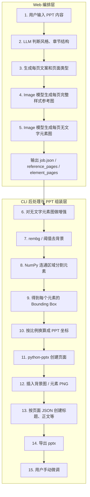

# PPT 自动制作系统

基于 AI 的多页 PPT 自动生成系统。支持通过 Web 前端或 CLI 两种方式使用，但两者并不是两套完全独立的能力：更准确地说，**Web 负责前半段的内容规划与生图编排，CLI 负责后半段的图像后处理与 PPTX 组装**。统一后的完整流程为：长文输入 → 对话模型规划拆页 → 生图模型生成带文字参考图 → 生图模型生成去文字元素图 → 图像增强与去背 → 连通域分割 → 坐标换算与 PPTX 组装。

---

## 15 步核心生成流水线架构

系统整体遵循以下 15 步端到端流程。根据当前代码库的设计，我们在下方梳理了每一步的职责、对应模块，以及需要注意和调整的细节。



### 步骤详解与模块映射

| 步骤 | 流程环节 | 对应文件/模块 | 实现详情与调整建议 |
| :--- | :--- | :--- | :--- |
| **1** | **用户输入 PPT 内容** | `web_app.py` / Front / `project_builder.py` | 用户通过 Web 页面或命令行传入长文本，并可附带上传风格参考图。 |
| **2** | **LLM 判断风格、章节结构** | `ppt_system/content_agent.py` | 使用多模态大模型分析上传的风格参考图，总结出包含 `style_core`、`layout_families` 和 `prompt_anchor` 的 **设计语法 (Design Grammar)**。 |
| **3** | **生成每页文案和页面类型** | `ppt_system/content_agent.py` | 规划器为每页 PPT 分配抽象的 `layout_family`（版式家族，如 `split_left_right`），规避具体的模板编号，实现“同风格、异版式”。 |
| **4** | **生图模型生成样式参考图** | `web_app.py` + `ppt_system/openai_image_provider.py` | Web 任务流会并发生成带文字排版的整页 PPT Mockup 效果图，并把结果写入 `reference_pages`。 |
| **5** | **生图模型生成无文字元素图** | `web_app.py` + `ppt_system/openai_image_provider.py` | Web 任务流将参考图送入 Edit 生图阶段，利用专门构建的 Prompt 擦除文字，仅保留背景及卡片、图标等非文字视觉元素，并写入 `element_pages`。 |
| **6** | **对无文字元素图做增强** | `ppt_pipeline.py` + `ppt_system/image_ops.py` | CLI 后处理阶段通过 `enhance_image` 做锐化、对比度增强以提升边界清晰度。统一流程上，这一步应视为 Web 生图完成后的后续子流程，而不是另一套独立链路。 |
| **7** | **rembg / 阈值去背景** | `ppt_pipeline.py` + `ppt_system/image_ops.py` | 优先通过 `rembg[gpu]` 库去除元素图背景；若未安装，会自动回退至基于纯白/高明度阈值的去背策略。该步骤承接 Web 输出的元素图继续执行。 |
| **8** | **分割透明元素** | `ppt_pipeline.py` + `ppt_system/splitter.py` | **【调整说明】** 原定使用 OpenCV 进行分割，当前实际实现是使用 NumPy 进行 **8-邻域 BFS 连通区域分析**，提取非透明区域。此法相较 OpenCV 更加轻量，且不易破坏 Alpha 通道，建议继续沿用。 |
| **9** | **得到元素 Bounding Box** | `ppt_pipeline.py` + `ppt_system/splitter.py` | 遍历连通区域，提取每个独立元素的 `left`, `top`, `width`, `height` 像素坐标和图像掩膜。 |
| **10** | **换算成 PPT 坐标** | `ppt_pipeline.py` + `ppt_system/composer.py` | 将图片像素坐标（如 2048x1152）按比例缩放并换算为 `python-pptx` 使用的英寸/EMU 物理尺寸坐标。 |
| **11** | **python-pptx 创建页面** | `ppt_pipeline.py` + `ppt_system/composer.py` | 使用空白版式 (`slide_layouts[6]`) 动态初始化幻灯片页面。 |
| **12** | **插入背景图 / 元素 PNG** | `ppt_pipeline.py` + `ppt_system/composer.py` | 在计算出的位置上，将分割去背后的 PNG 视觉元素以图片对象形式插入幻灯片。 |
| **13** | **创建可编辑文本框** | `ppt_pipeline.py` + `ppt_system/composer.py` | 依照规划阶段产出的文本结构与坐标信息，在 PPT 对应层级插入真正的、可编辑的文本框。 |
| **14** | **导出 PPTX 文件** | `ppt_pipeline.py` + `ppt_system/composer.py` | 汇聚图文，保存为 `.pptx` 物理文件。 |
| **15** | **用户手动微调** | Office / WPS | 用户下载 PPTX 后，可在本地 PowerPoint 中自由拖拽、修改文字与调整布局。 |

---

## 目录结构

```text
├── web_app.py                      # Flask Web 应用（主入口）
├── ppt_pipeline.py                 # CLI：项目 JSON → PPTX
├── project_builder.py              # CLI：长文 → 项目 JSON
├── split_image_to_ppt.py           # CLI：透明 PNG 拆分 → 单页 PPTX
├── smoke_test_images.py            # CLI：生图 API 烟雾测试
├── config.json                     # 全局配置（模型、尺寸、并发、重试）
├── .env                            # API Key 环境变量
│
├── ppt_system/                     # 核心库
│   ├── content_agent.py            # AI 内容规划 Agent（拆页 + 设计语法匹配）
│   ├── design_grammar.py           # 设计语法定义、Prompt 压缩及合法性校验
│   ├── generation_prompts.py       # 参考图 / 元素图 prompt 构建
│   ├── page_evaluator.py           # 页面风格一致性与版式差异度自动评估器
│   ├── openai_chat_provider.py     # 对话模型客户端
│   ├── openai_image_provider.py    # 生图模型客户端
│   ├── model_config.py             # 模型配置管理
│   ├── job_store.py                # SQLite 任务持久化
│   ├── planner.py                  # 风格推断与布局去重辅助
│   ├── text_layout.py              # 文句拆分 + 文本框 fallback 布局
│   ├── image_prompt.py             # 图像 prompt 构建（CLI 模式）
│   ├── image_ops.py                # 图像增强 + 去除背景（rembg/阈值）
│   ├── splitter.py                 # NumPy 8-连通域分析与透明元素切分
│   ├── composer.py                 # python-pptx 组装可编辑 PPTX
│   └── env_loader.py               # 环境变量加载
│
├── front/                          # Web 前端
│   ├── templates/index.html        # Jinja2 模板
│   └── static/
│       ├── app.js                  # 任务控制与状态展示前端逻辑
│       └── app.css                 # 暗色主题响应式样式
│
└── output/                         # 生成产物目录
    ├── jobs.sqlite3                # 任务持久化数据库
    └── <job_id>/                   # 单次任务输出文件夹
```

---

## 使用指南

### 0. 先理解 Web 与 CLI 的关系

当前仓库更适合按“**Web 前半段 + CLI 后半段**”来理解：

* **Web (`web_app.py`)**：负责接收长文和风格参考图，完成规划、参考图生成、元素图生成，并把中间结果沉淀到 `output/<job_id>/job.json`。
* **CLI (`ppt_pipeline.py`)**：负责把页面视觉图继续做增强、去背、连通域切分，并最终调用 `python-pptx` 组装可编辑 PPTX。
* **统一视角**：CLI 不是 Web 的替代物，而是当前代码库里承接 Web 生图结果、完成 PPT 落地的后处理执行层。

### 1. 运行 Web 服务
环境：`conda activate aippt`  

执行以下命令启动 Web 界面，访问 `http://127.0.0.1:7860` 即可开始：

```powershell
python web_app.py
```

* 可以在前端页面输入长文，上传风格图，实时观察 **模型规划 (Planning)**、**参考图生成** 和 **元素图生成** 的状态。
* 在前端的“风格 Grammar”折叠面板中，可直接查看 AI 分析并沉淀下来的核心配色、版式家族与风格锚点。
* Web 任务完成后，会在 `output/<job_id>/` 下写出 `job.json`、`01_reference_pages/`、`02_elements_pages/` 等中间产物，供后续 CLI 后处理使用。

### 2. 运行 CLI 流程

#### 步骤 A：从长文本和风格参考图生成项目配置文件 (`project.json`)
```powershell
python project_builder.py --content-file sample_content.txt --visual-image "style_sample.png" --output project.generated.json --title "智能汇报系统方案"
```

#### 步骤 B：解析配置文件并生成 PPTX 文件
```powershell
python ppt_pipeline.py --project project.generated.json --output auto_ppt_output.pptx
```

### 3. Web 产物如何接到 CLI

从数据结构上看，Web 已经产出了 CLI 后半段所需的大部分信息，只是当前仓库里还没有封装成一个现成的“`job.json` 直接转 `project.json`”命令。

| Web 任务产物 | 可衔接到的 CLI 字段 | 说明 |
| :--- | :--- | :--- |
| `job.json.plan` / `job.json.pages` | `project.pages[*].title` / `summary` / `texts` | Web 规划阶段已经生成页面文本与布局信息。 |
| `job.json.element_pages[*].image` | `project.pages[*].visual_image` | Web 第二阶段输出的去文字元素图，就是 CLI 后处理的视觉图输入。 |
| `config.snapshot.json` 中的尺寸信息 | `project.image_width` / `project.image_height` | 需要保持像素尺寸一致，确保后续坐标换算正确。 |
| `job.json.plan.style_guide` | 扩展字段 | 目前 `ppt_pipeline.py` 组装 PPT 时不强依赖，但适合作为后续扩展点保留。 |

换句话说，**Web 已经完成“内容与页面视觉资产生产”，CLI 完成“资产清洗、切分与 PPT 组装”**。如果后续要做真正的一键式 Web 导出 PPTX，最自然的实现方式不是重写一套组装逻辑，而是把这段 CLI 后处理链路内聚成可被 `web_app.py` 直接调用的服务层。

---

## 核心设计机制

### 1. 设计语法驱动 (Design Grammar)
为了防止多页 PPT 风格跑偏，本系统采用 **Design Grammar** 约束。
* **固定层**：定义了全局配色方案 (`palette`)、背景明度 (`background_tone`) 以及卡片描边与图标风格。
* **变化层**：页面与页面之间交替使用不同的版式家族 (`layout_families`)，如 `timeline_horizontal` 与 `split_left_right` 交叉使用，确保页面的骨架结构具有多样性。

### 2. Prompt 压缩与锁定
在向生图模型发送请求前，系统会对 Design Grammar 字典进行压缩：
* **Compressed 模式**：将繁杂的规则压缩为简洁的 `prompt_anchor`（风格锚点短句）和核心约束，有效避免生图 Prompt 超长导致模型无法聚焦。

### 3. 可编辑文本插入
分割出的 PNG 元素仅作为视觉背景和装饰（如卡片边框、修饰线条、插图等），文本内容在 PPT 组装时，会根据推算出的坐标作为 **原生 PowerPoint 文本框** 覆盖插入。这意味着导出的 `.pptx` 文件中，所有标题和正文都是**可直接点击并编辑的真实文字**，极大地方便了后续的人工微调。
