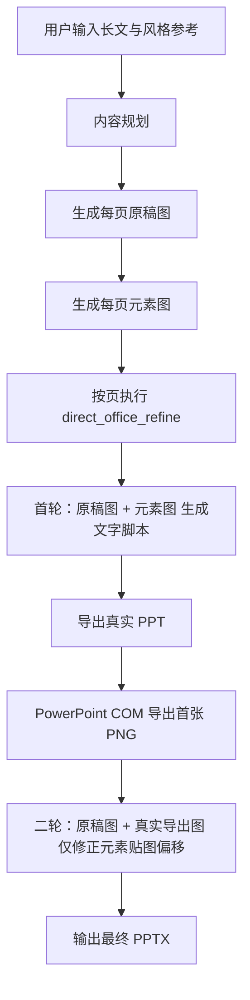

# PPT 自动制作系统

本系统当前已经收敛到一条统一导出主路径：

1. Web 负责内容规划、原稿图生成、元素图生成。
2. 导出阶段使用 `direct_office_refine`：
   - 首轮：`原稿图 + 元素图`
   - 二轮：`原稿图 + PowerPoint 真导出图`
3. 最终输出为带分割元素资源和可编辑文本框叠加的 `.pptx`。

> 标准入口说明见 [README.md](README.md)。新人接手时优先阅读 [docs/architecture.md](docs/architecture.md) 与 [docs/runbook.md](docs/runbook.md)。

---

## 当前主路径



## 模块概览

```text
├── web_app.py
├── ppt_pipeline.py
├── rerun_text_page.py
├── tools/
│   └── ...
├── ppt_system/
│   ├── content_agent.py
│   ├── design_grammar.py
│   ├── direct_page_script.py
│   ├── direct_project_script.py
│   ├── export_pipeline.py
│   ├── generation_prompts.py
│   ├── openai_chat_provider.py
│   ├── openai_image_provider.py
│   ├── ppt_calibration_renderer.py
│   ├── text_script_runtime.py
│   ├── text_style_runtime.py
│   └── ...
└── tests/
```

## 使用方式

### Web

```powershell
python web_app.py
```

访问 `http://127.0.0.1:7860`。

### CLI：项目级导出

```powershell
python ppt_pipeline.py --project project.generated.json --output auto_ppt_output.pptx
```

## 输出产物

`output/<job_id>/` 或指定输出目录下通常包含：

- `project.generated.json`
- `work/generated_text_layout.py`
- `work/page_XX/assets/assets.json`
- `work/office_preview_round_01.png`
- `work/comparison_round_01.png`
- 最终 `.pptx`

## 设计原则

- 只有一条导出主路径，不再保留 legacy/builtin 文字回退。
- 文本框始终使用 `MSO_AUTO_SIZE.NONE`，避免 PowerPoint 自动缩放破坏字号。
- 元素图会经过增强、透明化与分割，再作为图片资源与文字框一起叠加进 PPT。
- 真实闭环优先依赖 PowerPoint COM 真导出图，不再使用 PIL 预览校正链。
