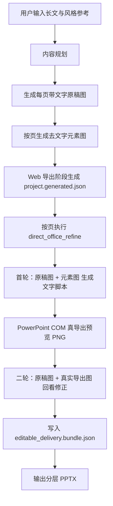

# PPT 自动制作系统

本系统当前已经收敛到一条统一 Web 主路径：

1. `main.py` 启动 Flask 后端，`ppt_system/web/` 提供配置、任务、产物和 Agent 相关 API。
2. `web_ui/` 提供 React/Vite 前端；生产构建输出到 `web_ui/dist` 后由 Flask 托管。
3. 任务流水线负责内容规划、原稿图生成、元素图生成和可编辑 PPT 导出。
4. 导出阶段使用 `direct_office_refine`：
   - 首轮：`原稿图 + 元素图`
   - 二轮：`原稿图 + PowerPoint 真导出图`
5. 最终输出为分层 `.pptx`，默认将元素资源页与可编辑文本框页成对交付，便于后续手动叠加或单独修改。

> 标准入口说明见 [README.md](README.md)。新人接手时优先阅读 [docs/architecture.md](docs/architecture.md) 与 [docs/runbook.md](docs/runbook.md)。

---

## 当前主路径



## 模块概览

```text
├── main.py
├── web_ui/
│   ├── src/
│   └── dist/
├── tools/
│   └── ...
├── ppt_system/
│   ├── generation/
│   ├── export/
│   ├── image/
│   ├── integrations/
│   ├── jobs/
│   ├── runtime/
│   └── web/
└── tests/
```

## 使用方式

### Web

```powershell
python main.py
```

访问 `http://127.0.0.1:7860`。

### 前端构建

```powershell
Set-Location web_ui
npm install
npm run build
Set-Location ..
```

开发前端时可在 `web_ui` 内运行 `npm run dev`，后端 API 由 `python main.py` 提供。

## 输出产物

`output/<job_id>/` 下通常包含：

- `status.json`
- `job.json`
- `01_reference_pages/`
- `02_elements_pages/`
- `03_ppt_build/editable_delivery.bundle.json`
- `project.generated.json`
- `03_ppt_build/generated_text_layout.py`
- `03_ppt_build/page_XX/assets/assets.json`
- `03_ppt_build/page_XX/office_preview_round_01.png`
- `03_ppt_build/page_XX/comparison_round_01.png`
- `04_image_edits/`（图片编辑候选生成后出现）
- 最终分层 `.pptx`

任务状态还会保存 `operations`、`page_versions`、`agent_conversation`、`agent_pending_draft` 和 `image_edit_candidates` 等增量协作信息。

## 设计原则

- 只有一条导出主路径，不再保留 legacy/builtin 文字回退。
- 文本框始终使用 `MSO_AUTO_SIZE.NONE`，避免 PowerPoint 自动缩放破坏字号。
- 元素图会经过增强、透明化与分割，再作为图片资源与文字框一起叠加进 PPT。
- 真实闭环优先依赖 PowerPoint COM 真导出图，不再使用 PIL 预览校正链。
- Agent 对话先沉淀为结构化草案或候选图，用户确认后才应用到任务状态或替换页面图片。
