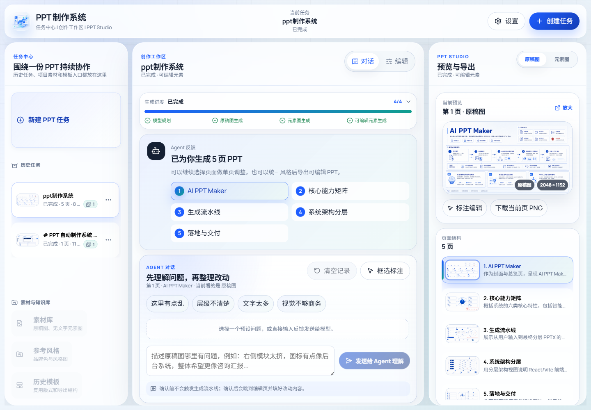
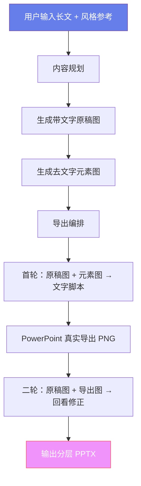

<p align="center">
  <h1 align="center">🎨 AI PPT Maker</h1>
  <p align="center">
    <strong>基于 AI 的全自动多页 PPT 生成系统</strong>
  </p>
  <p align="center">
    输入长文内容 → AI 规划版式与风格 → 自动生成精美配图 → 导出可编辑分层 PPTX
  </p>
  <p align="center">
    <a href="#-快速开始">快速开始</a> •
    <a href="#-核心特性">核心特性</a> •
    <a href="#-架构总览">架构总览</a> •
    <a href="#-项目结构">项目结构</a> •
    <a href="#-请我喝一杯咖啡">请我喝咖啡</a> •
    <a href="docs/architecture.md">架构文档</a> •
    <a href="docs/runbook.md">运行手册</a>
  </p>
</p>

---

## ✨ 项目简介

AI PPT Maker 是一个端到端的 AI 驱动 PPT 自动制作系统。只需输入一段长文内容和可选的风格参考图，系统就能自动完成内容规划、版式设计、配图生成和可编辑 PPT 导出的全流程——无需手动排版，即可获得专业级的演示文稿。

系统采用 **Flask 后端 + React/Vite 前端** 架构，内置完整的 Web 创作工作区，支持任务管理、实时进度追踪、Agent 辅助编辑和图片标注等交互功能。

## ⚠️ 注意
本人用的模型为**gpt5.5+gpt-image-2**，没尝试过其他模型的效果，使用其他模型的效果暂时请自己探索。如若你用的是**中转站api**，请**务必把代理关闭**，不然图片可能无法正常生成

## 🖥️ 系统界面

当前 Web 工作区将任务中心、Agent 对话和 PPT Studio 预览导出集中在同一界面，方便围绕一份 PPT 持续协作。

<p align="center">
  
</p>

## 📎 效果演示

- [图片 PPT 演示](图片ppt演示.pptx)：展示系统生成的图片版 PPT 效果。
- [可编辑效果演示（手动调整）](可编辑效果演示（手动调整）.pptx)：展示导出后可继续编辑和人工微调的分层 PPTX 效果。

## 🚀 核心特性

### 🧠 智能内容规划
- 对话模型自动分析长文，生成风格指南（`style_guide`）和逐页规划
- **设计语法系统**：归一化版式家族，确保页间版式多样性（≥3 种版式家族、相邻页不重复）
- 支持 prompt 压缩策略，优化 Token 消耗

### 🎨 两阶段图像生成
- **原稿图（Reference）**：生成带文字的完整页面视觉稿
- **元素图（Elements）**：基于原稿图生成去文字的纯元素背景图
- 支持风格参考图引导生成，保持全套 PPT 视觉一致性
- 并发生成，可配置并发数

### 🔄 双轮闭环导出
- **首轮**：`原稿图 + 元素图` → AI 生成文字层布局脚本
- **二轮**：`原稿图 + PowerPoint 真实导出图` → AI 回看修正文字位置与样式
- 元素图经过增强、透明化和连通域分割，精确叠加到 PPT 中

### 📦 分层 PPTX 交付
- 默认输出「元素资源页 + 可编辑文本框页」的成对分层结构
- 文本框完全可编辑，方便二次修改
- 支持单页导出和整套导出两种交付模式

### 🌐 Web 创作工作区
- **创作表单**：输入内容、选择页数、上传风格参考图
- **PPT Studio**：实时预览生成结果，对比原稿图与导出效果
- **任务中心**：管理所有生成任务，支持暂停/续跑/中断
- **Agent 对话**：通过自然语言对话生成结构化修改草案
- **图片标注编辑**：可视化标注区域，生成图片编辑候选
- **模型配置**：可视化管理多组对话/生图模型，API Key 安全存储

### 🛡️ 可靠的任务引擎
- 全阶段断点续跑（规划、原稿图、元素图、导出均可恢复）
- 单页重生成、文字优化、排版优化、风格调整
- 页面版本管理，操作可回退
- SSE 实时推送任务进度

## 📐 架构总览



```
┌─────────────────────────────────────────────────────────┐
│                    React/Vite 前端                       │
│  CreationForm · PPTStudio · TaskCenter · AgentChat      │
├─────────────────────────────────────────────────────────┤
│                    Flask API 后端                        │
│  Blueprint 路由 → Service 编排 → Pipeline 执行           │
├──────────────┬──────────────┬───────────────────────────┤
│  generation/ │   export/    │        image/             │
│  内容规划     │  导出编排     │     元素处理               │
│  设计语法     │  文字脚本     │     背景移除               │
│  Prompt 构建  │  PPT 渲染    │     连通域分割             │
├──────────────┴──────────────┴───────────────────────────┤
│                  integrations/                          │
│        OpenAI Chat Provider · OpenAI Image Provider     │
└─────────────────────────────────────────────────────────┘
```

## 🏁 快速开始

### 环境要求

- **Python** 3.10+
- **Node.js** 18+（用于前端构建）
- **OpenAI 兼容 API**：需要可用的对话模型和图像生成模型

### 1. 克隆仓库

```bash
git clone https://github.com/1624899/ai-ppt-maker.git
cd ai-ppt-maker
```

### 2. 安装后端依赖

```bash
pip install -r requirements.txt
```

### 3. 安装并构建前端

```bash
cd web_ui
npm install
npm run build
cd ..
```

### 4. 配置模型

首次运行后，在 Web 界面的「模型配置」页面录入 API Key 和模型端点即可，系统会自动将密钥安全写入本地 `.env` 文件。

你也可以手动创建 `.env`：

```env
# 对话模型 API Key（用于内容规划和文字脚本生成）
PPT_SYSTEM_CHAT_<CONFIG_ID>_API_KEY=sk-xxx

# 图像模型 API Key（用于原稿图和元素图生成）
PPT_SYSTEM_IMAGE_<CONFIG_ID>_API_KEY=sk-xxx
```

默认配置对应的变量名可参考 [.env.example](.env.example)。

### 5. 启动服务

```bash
python main.py
```

访问 **http://127.0.0.1:7860** 即可开始使用。

### 前端开发模式（可选）

如果需要修改前端代码，可以启动 Vite 开发服务器：

```bash
cd web_ui
npm run dev
```

前端开发服务默认运行在 `http://127.0.0.1:5173`，API 请求会自动代理到后端。

## 📁 项目结构

```
ai-ppt-maker/
├── main.py                     # Flask 后端启动入口
├── config.json                 # 全局配置（模型、尺寸、并发、重试等）
├── requirements.txt            # Python 依赖
├── ppt_system/                 # 核心库
│   ├── generation/             # 内容规划、设计语法、Prompt 构建
│   │   ├── content_agent.py    #   AI 内容规划与风格指南生成
│   │   ├── design_grammar.py   #   版式家族归一化与多样性约束
│   │   ├── generation_prompts.py #  原稿图/元素图 Prompt 构建
│   │   ├── page_evaluator.py   #   页面规划质量评估
│   │   └── style_runtime.py    #   风格运行时
│   ├── export/                 # 导出编排与 PPT 生成
│   │   ├── export_pipeline.py  #   Web 任务 → 导出项目转换
│   │   ├── direct_project_script.py # 双轮闭环导出主流程
│   │   ├── text_script_runtime.py #  文字层脚本校验与执行
│   │   └── ppt_calibration_renderer.py # PowerPoint 真渲染
│   ├── image/                  # 图像处理与元素分割
│   │   ├── splitter.py         #   连通域分割
│   │   ├── background_removal.py #  背景移除与透明化
│   │   ├── global_element_alignment.py # 全局元素对齐
│   │   └── ...                 #   Alpha 处理、形态学、颜色聚类等
│   ├── integrations/           # 外部模型接入
│   │   ├── openai_chat_provider.py #  对话模型适配
│   │   ├── openai_image_provider.py # 图像模型适配
│   │   └── model_config.py     #   多模型档案管理
│   ├── jobs/                   # 任务状态与持久化
│   │   ├── job_store.py        #   SQLite 任务存储
│   │   └── active_job_registry.py # 活跃任务注册
│   └── web/                    # Web 层
│       ├── app.py              #   Flask 应用工厂
│       ├── blueprints/         #   API 路由（配置、任务、产物等）
│       └── services/           #   业务服务（Pipeline、Operations、Agent）
├── web_ui/                     # React/Vite 前端
│   └── src/
│       ├── components/
│       │   ├── Workspace/      #   核心工作区组件
│       │   ├── Forms/          #   表单组件
│       │   ├── Layout/         #   布局组件
│       │   └── Motion/         #   动画组件
│       ├── hooks/              #   自定义 Hooks
│       └── utils/              #   工具函数
├── tools/                      # 维护与诊断工具
├── tests/                      # 单元测试（34 个测试文件）
├── scripts/                    # 辅助脚本
├── docs/                       # 项目文档
│   ├── architecture.md         #   架构说明
│   └── runbook.md              #   运行手册
└── output/                     # 运行时产物（gitignore）
    ├── jobs.sqlite3            #   任务数据库
    └── <job_id>/               #   每个任务的工作目录
```

## ⚙️ 配置说明

核心配置集中在 `config.json`，主要配置项包括：

| 配置项 | 说明 | 默认值 |
|--------|------|--------|
| `default_pages` | 默认生成页数 | `4` |
| `max_pages` | 最大页数限制 | `10` |
| `default_image_preset` | 默认图片尺寸预设 | `landscape_2k` |
| `stage1_concurrency` | 原稿图生成并发数 | `5` |
| `stage2_concurrency` | 元素图生成并发数 | `5` |
| `request_retry_count` | 请求重试次数 | `4` |
| `enable_design_grammar` | 启用设计语法系统 | `true` |
| `enable_page_evaluation` | 启用页面质量评估 | `true` |
| `prompt_compression_mode` | Prompt 压缩策略 | `compressed` |

### 图片尺寸预设

| 预设 ID | 分辨率 | 比例 |
|---------|--------|------|
| `square_1k` | 1024×1024 | 1:1 |
| `landscape_1k` | 1536×1024 | 3:2 |
| `landscape_2k` | 2048×1152 | 16:9 |
| `landscape_4k` | 3840×2160 | 16:9 |
| `portrait_1k` | 1024×1536 | 2:3 |
| `portrait_4k` | 2160×3840 | 9:16 |

### 模型配置

系统支持配置多组对话模型和生图模型，通过 Web 界面可视化管理。API Key 不写入 `config.json`，统一通过环境变量安全存储，首次在 Web 界面保存时会自动创建 `.env` 文件。

## 🔌 API 概览

后端提供 RESTful API，主要端点：

| 方法 | 路径 | 说明 |
|------|------|------|
| `POST` | `/api/jobs` | 创建生成任务 |
| `GET` | `/api/jobs/:id` | 获取任务状态 |
| `GET` | `/api/jobs/:id/stream` | SSE 实时进度推送 |
| `POST` | `/api/jobs/:id/interrupt` | 中断任务 |
| `POST` | `/api/jobs/:id/resume` | 续跑任务 |
| `POST` | `/api/jobs/:id/deliver` | 重新导出交付版本 |
| `POST` | `/api/jobs/:id/operations` | 提交页面操作（重生成/优化/调整） |
| `POST` | `/api/jobs/:id/agent/draft` | 生成 Agent 修改草案 |
| `POST` | `/api/jobs/:id/image-edit-candidates` | 生成图片编辑候选 |

完整 API 文档参见 [运行手册](docs/runbook.md)。

## 🧪 测试

项目包含 34 个测试文件，覆盖核心模块的单元测试：

```bash
# 运行全部测试
python -m pytest -q

# 验证前端构建
cd web_ui
npm run build
```

## 🛠️ 维护工具

`tools/` 目录提供了一系列诊断和维护脚本：

| 工具 | 用途 |
|------|------|
| `inspect_layered_ppt.py` | 检查分层 PPT 结构 |
| `render_preview_from_script.py` | 从文字脚本渲染预览 |
| `rerun_transparent_asset_split.py` | 重新执行元素分割 |
| `render_global_alignment_diagnostics.py` | 全局对齐诊断 |
| `assemble_assets_only_ppt.py` | 仅资产组装 PPT |
| `assemble_preview_ppt_from_assets.py` | 从资产组装预览 PPT |
| `reconstruct_transparent_pages_from_assets.py` | 重建透明页面 |

## 🔧 技术栈

| 层级 | 技术 |
|------|------|
| 前端框架 | React 19 + Vite 5 |
| 前端动画 | Framer Motion |
| 前端图标 | Lucide React |
| 后端框架 | Flask (Python) |
| PPT 生成 | python-pptx |
| 图像处理 | OpenCV |
| AI 模型 | OpenAI 兼容 API（对话 + 图像生成） |
| 任务持久化 | SQLite |
| 真实渲染 | PowerPoint COM（可选） |

## 🤝 参与贡献

欢迎提交 Issue 和 Pull Request！

1. Fork 本仓库
2. 创建特性分支：`git checkout -b feature/amazing-feature`
3. 提交更改：`git commit -m 'Add amazing feature'`
4. 推送分支：`git push origin feature/amazing-feature`
5. 发起 Pull Request

## ☕ 请我喝一杯咖啡

如果这个项目对你有帮助，欢迎请我喝一杯咖啡。你的支持会用于持续维护项目、完善文档和补充更多实用示例。

我会认真感谢每一位支持我的朋友，也感谢每一次反馈、建议和使用。

<p align="center">
  
  &nbsp;&nbsp;&nbsp;&nbsp;
  
</p>

<p align="center">
  <strong>微信</strong>
  &nbsp;&nbsp;&nbsp;&nbsp;&nbsp;&nbsp;&nbsp;&nbsp;
  <strong>支付宝</strong>
</p>

## 📄 许可证

本项目采用 **非商业使用许可证（Non-Commercial Use License）**。

- ✅ 允许：个人学习、研究、教育用途
- ✅ 允许：非商业性质的内部使用
- ❌ 禁止：未经授权的任何商业使用

如需商业授权，请联系作者：**1624899229@qq.com**

详见 [LICENSE](LICENSE) 文件。
